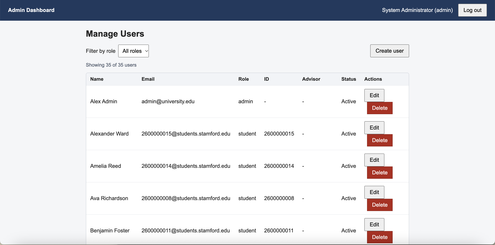
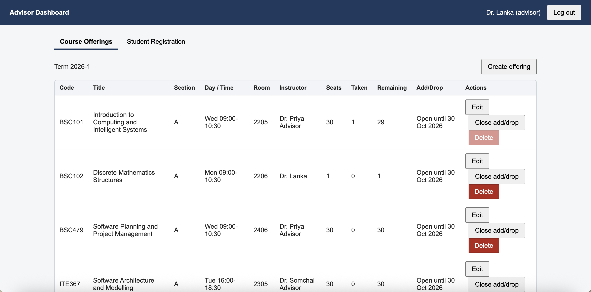
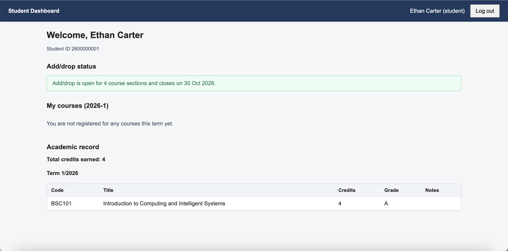

# Course Registration System

## Group Information

- Group Number: [ 5 ]

## Team Members

1.  Kanravi Charoentanaset (2402290003) - Team Lead / Integrator
2.  Hein Kyaw Zaw (2507090001) - Backend developer (API)
3.  Kaung Sithu Tun 2403040020 - database and date lead
4.  Zwe Maung Maung Than 2310040006 - Front-end developer A/B

## Project Description

This project is a fill-stack Course Registration System for a unisversity department.

The system will provides three users roles:

1. Administration
2. Academic Advisor
3. Student

Each role in registration system has different and fucntion according to their responsibilities within the course registration process.

## Feature

### Authentication

- Login for Admin, Advisor, Student
- Passwords stored only as bcrypt hashes
- JWT authentication
- Role-based authentication
- Protect routes for different user role
- Automatic redirection based on user role

### Admin

- Manage user account
- Create users
- Delete users 
- Edit users
- Manage users roles


### Advisor

- open course offering
- Manage sections and seats
- Register a students
- Manage Add/Drop windows
- Check student course eligibility
-  View student information
- View student academic records

### Student

- View the courses registered
- View completed courses
- View GPA
- View course graded or retake requirement course
- Request add/drop
- Check course eligibility
- View add/drop request

## Technology

### Frontend

- React
- Javascript
- React Router
- Vite

### Backend

- Node.js
- Express.js
- JWT

### Database

- MongoDB
- Mongoose

### Authentication and Security

- bcrypt
- JWT

## Project structure

```
Course-Registration-System/
│
├── client/
|   ├── publice/
|   |   ├── favicon.svg
|   |   └── icons.svg
│   ├── src/
│   │   ├── components/
│   │   ├── context/
|   |   ├── hooks/
│   │   ├── pages/
│   │   ├── services/
│   │   └── utils/
|   ├── .env.example
|   ├── .gitignore
|   ├── index.html
│   ├── package.json
│   └── package-lock.json
│
├── docs/
|   ├── data-model.md
|   ├── database-design-diagram.md
│   └── data-model.md
│
├── server/
|   ├── config/
│   ├── controllers/
│   ├── middleware/
│   ├── models/
│   ├── routes/
│   ├── seed/
|   ├── utils/
|   ├── .env.example
|   ├── server.js
|   ├── .gitignore
│   ├── package.json
│   └── package-lock.json
│
├── .gitignore
└── README.md

```

## Data layer

The Mongoose models in `server/models` define the persistence contract for users, courses, offerings, registrations, and academic records. 

- Users - stores administrator, advisor, and student information 
- Course - stores course information, programs, catagories, and course status
- Offering - stores course section, terms, instructors, schedules, and registration period
- Registration - stores students course registration information
- Record - stores student academic records and grades

See `docs/data-model.md` for relationships, required fields, and invariants.

## Setup and Installation

- Clone the repository and install dependencies for both the backend and frontend

```
    git clone <repository-url>
    cd Course-Registration-System

    cd server
    npm install

    cd client
    npm install

```
- Create the required .env file in the server folder

 ```
    MONGO_URI=your_mongodb_connection_string
    JWT_SECRET=your_jwt_secret
    PORT=5000

```
- Create the frontend environment file

``` 
    VITE_API_URL=http://localhost:5000/api

```
- Run the seed command from the server folder

```
    npm run seed

```
This loads the required sample users, courses, offerings, registrations, and academic records into the database

- Run the backend server

```
    cd server
    npm run dev
```
backend will run on : http://localhost:5000

- Run frontend server

```
    cd client
    npm run dev

```
Open the URL shown by Vite : http://localhost:5173

### Test Login Account
The seeded databased provide test accounts for each user role

| Role | Email | Password |
|---|---|---|
| Admin | admin@example.com | ChangeMe123! |
| Advisor | advisor@example.com | ChangeMe123! |
| Student | 2600000001@students.stamford.edu | ChangeMe123! |

## Dashboard Screenshots
### Admin Dashboard


### Advisor Dashboard


### Student Dashboard


## Feature Completion Status

### Completed
1. User authentication with JWT
2. Password hashing with bcrypt
3. Role-based access for Admin, Advisor, and Student
4. Admin user management
5. Advisor course offering management
6. Student academic record viewing
7. Course registration management
8. Add/Drop request workflow

### Partially Completed

- None

### Not Attempted

- None