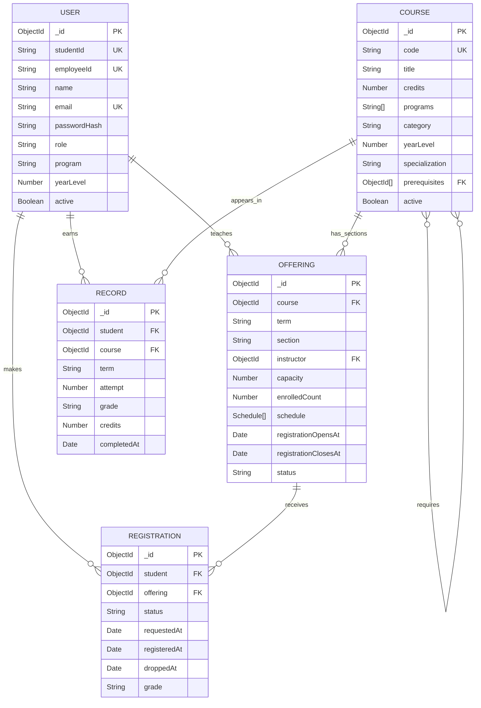

# Stamford International University Course Registration System
## Database Design Diagram

### Collection responsibilities

| Collection | Purpose | Important constraint |
|---|---|---|
| `users` | Admin, advisor, and student identities | Unique email and student/employee IDs |
| `courses` | Stamford CS and IT curriculum catalog | Unique course code |
| `offerings` | Course sections in terms `1/2026`, `2/2026`, and `3/2026` | Unique course + term + section; enrollment cannot exceed capacity |
| `registrations` | Student request, enrollment, drop, and grade state | Unique student + offering |
| `records` | Permanent academic history and retakes | Unique student + course + attempt |

### Relationship notes

- One `User` can teach many `Offerings`; each offering has one instructor.
- One `Course` can have many `Offerings`; each offering belongs to one course.
- A student connects to an offering through `Registration`.
- A student's completed course history is stored in `Record`.
- `Course.prerequisites` is a self-reference to other courses.
- `Schedule` is an embedded subdocument inside `Offering`, not a separate collection.

### Keys and security

`PK` means MongoDB document identifier. `FK` means a Mongoose reference to another
document. `UK` means a unique index. Passwords are stored only as bcrypt hashes;
the `passwordHash` field is excluded from normal queries.